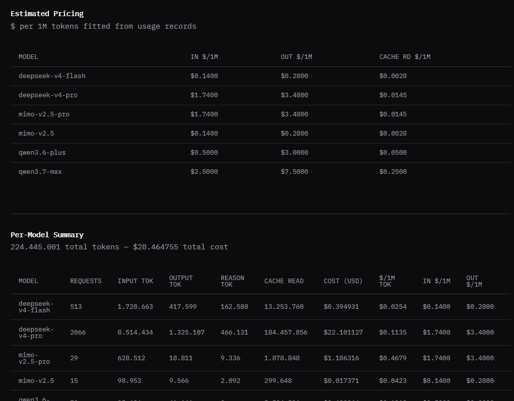
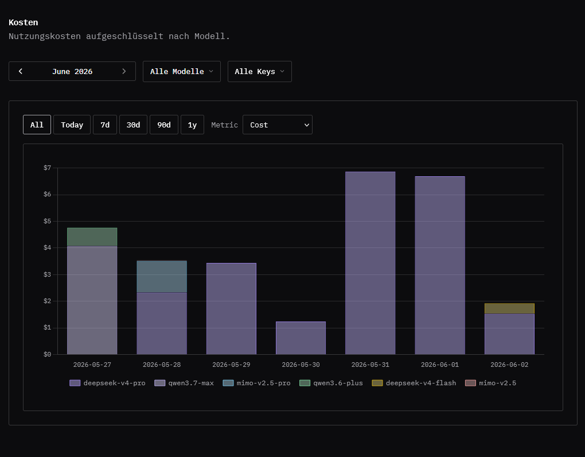
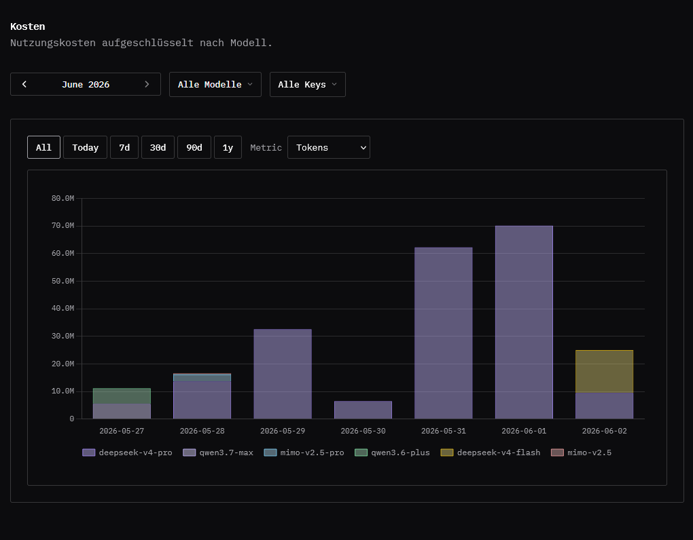
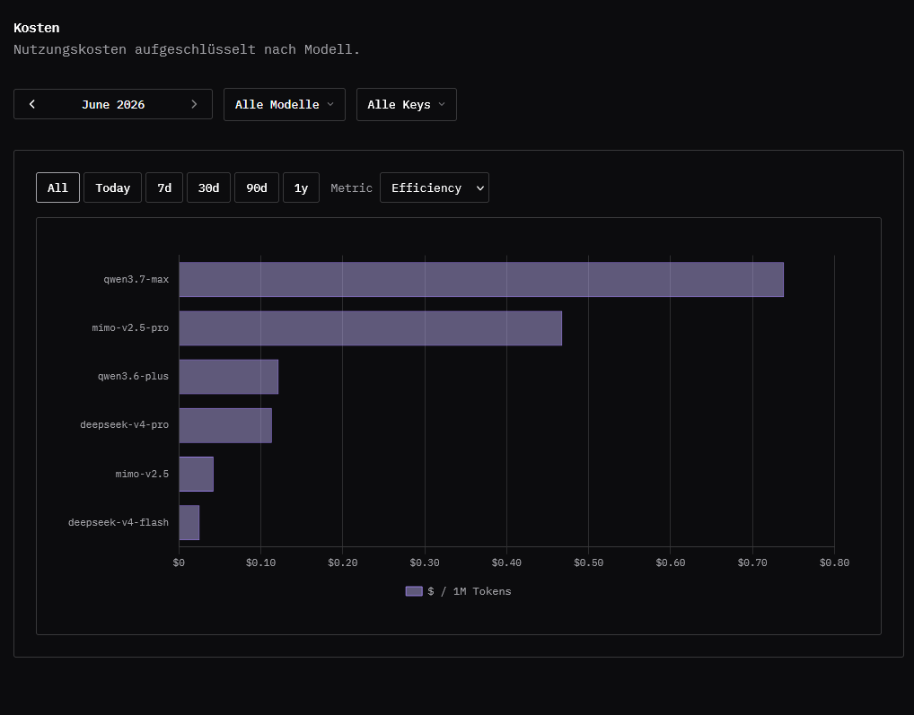
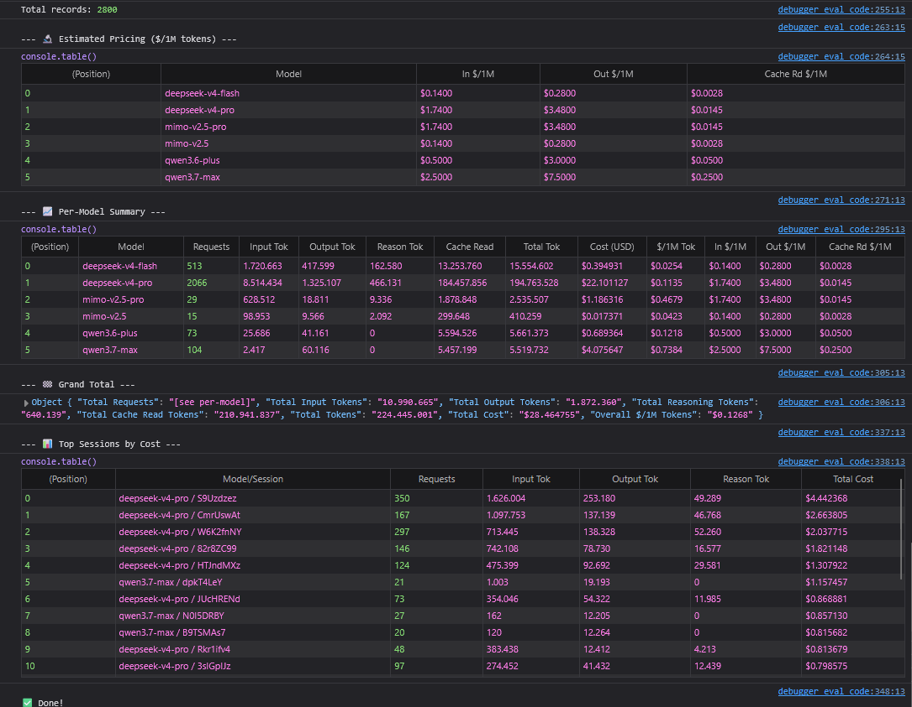

# OpenCode Go Stats

Adds token and cost breakdowns to [opencode.ai](https://opencode.ai) workspace usage pages.

There are three ways to run it:

| Version | Best for | Output |
|---|---|---|
| Browser extension | Keeping stats on the usage page | Inline tables and charts |
| Userscript | Getting the same dashboard through a userscript manager | Inline tables and charts |
| Console script | One-off inspection from DevTools | `console.table()` reports and session totals |

The extension and userscript share the same dashboard code. The console script is separate: it prints a report, exposes raw data on `window.__opencodeStats`, and includes the session breakdown.

## Tables



The dashboard adds two tables above the normal usage list.

| Table | What it shows |
|---|---|
| Estimated Pricing | Per-model input, output, and cache-read prices in dollars per 1M tokens. These are fitted from usage records that include cost data. |
| Per-Model Summary | Requests, input tokens, output tokens, reasoning tokens, cache reads, total cost, and effective dollars per 1M tokens for each model. |

The summary table also includes the fitted pricing columns when pricing can be estimated for the model.

## Charts

The dashboard has range filters for `All`, `Today`, `7d`, `30d`, `90d`, and `1y`. The selected range updates the tables and the chart together.

Three of the chart modes are daily stacked bars, split by model:

| Chart | What it answers |
|---|---|
| Cost | How much each model cost per day. |
| Tokens | How many input, output, reasoning, and cache-read tokens each model used per day, summed into one token total. |
| Requests | How many requests each model handled per day. |

Two chart modes compare models across the selected range:

| Chart | What it answers |
|---|---|
| Efficiency | Which models were most expensive per 1M tokens. This is a horizontal bar chart sorted by effective dollars per 1M tokens. |
| Share | Which models accounted for the largest share of total cost. This is a horizontal bar chart with percent share and dollar cost in the tooltip. |

Example chart views:

| Cost | Tokens | Efficiency |
|---|---|---|
|  |  |  |

## Console Script



`pull-stats.js` is for quick checks without installing anything. Open an opencode.ai workspace usage page, paste the script into the browser console, and run it.

It prints:

| Section | What it contains |
|---|---|
| Estimated Pricing | The same fitted per-model prices used by the dashboard. |
| Per-Model Summary | Request, token, cost, and effective price totals by model. |
| Grand Total | Workspace-wide token and cost totals. |
| Top Sessions by Cost | The 20 most expensive model/session pairs. This is console-only. |

After it finishes, the parsed records and computed summaries are available as `window.__opencodeStats`.

## Install

### Browser Extension

Load the `extension/` directory as an unpacked extension.

| Browser | Steps |
|---|---|
| Chrome | Open Extensions, enable Developer mode, choose Load unpacked, then select `extension/`. |
| Firefox | Open `about:debugging`, choose This Firefox, choose Load Temporary Add-on, then select `extension/manifest.json`. |

The extension runs on `https://opencode.ai/workspace/*/usage`.

### Userscript

Install `opencode-stats.user.js` with [Tampermonkey](https://www.tampermonkey.net/), [Violentmonkey](https://violentmonkey.github.io/), or another userscript manager.

The userscript runs on the same usage pages as the extension and renders the same dashboard.

### Console Script

Open an opencode.ai workspace usage page, paste the contents of `pull-stats.js` into DevTools, and run it.

## Build

```bash
npm install
npm run build
```

`npm run build` produces:

| Output | Source entry | Purpose |
|---|---|---|
| `extension/content.js` | `src/extension.ts` | Browser extension content script. |
| `opencode-stats.user.js` | `src/extension.ts` | Userscript dashboard. |
| `pull-stats.js` | `src/console.ts` | Console-only report. |

Shared parsing, pricing, stats, and cache logic lives under `src/`.

## Release

```bash
npm run release
```

This builds the extension and writes `extension.zip`.

## Type Check

```bash
npm run check
```

## How It Works

1. Reads the workspace ID from the current usage page URL.
2. Fetches usage pages through opencode.ai's internal `/_server` endpoint.
3. Deduplicates records and merges them with records cached in `localStorage`.
4. Computes per-model request, token, and cost totals.
5. Estimates per-model token prices by solving a linear system from records with cost data.
6. Renders the dashboard or prints the console report, depending on the script being used.

Pricing is estimated from your recorded usage, so a model may not show fitted prices until there is enough cost-bearing data for that model.
