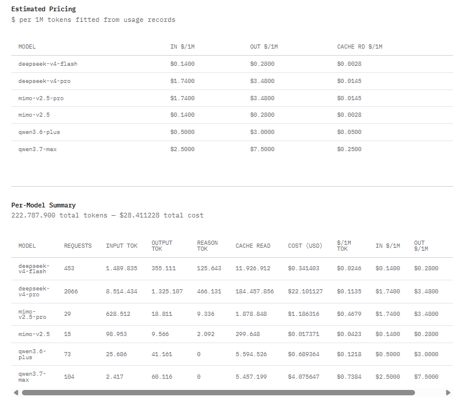
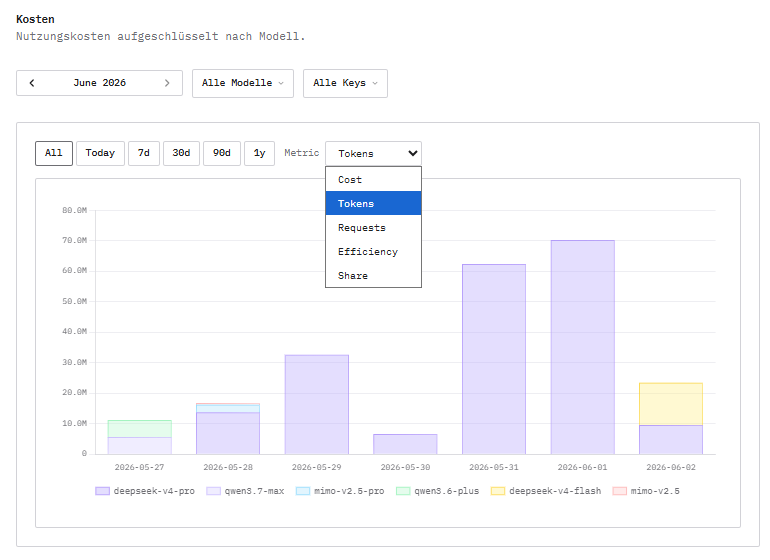

# OpenCode Stats

Browser extension and console script that adds per-model token/cost analytics to [opencode.ai](https://opencode.ai) workspace usage pages.

## Features

- **Per-Model Summary Table** — Requests, input/output/reasoning/cache tokens, total cost, and $/1M tokens for each model
- **Estimated Pricing Table** — Fits per-unit prices from usage records (input, output, cache read $/1M tokens) using linear regression
- **Interactive Charts** — Date range filter (All, Today, 7d, 30d, 90d, 1y) with switchable metrics:
  - Cost (daily stacked bar)
  - Tokens (daily stacked bar)
  - Requests (daily stacked bar)
  - Efficiency ($/1M tokens per model)
  - Share (cost share per model)
- **Session Breakdown** — Top 20 most expensive sessions logged to console
- **Caching** — Usage records are cached in localStorage so subsequent visits only fetch newly created records

## Screenshots

| Tables | Charts |
|---|---|
|  |  |

## Build

```bash
npm install
npm run build
```

`npm run build` produces two scripts from the same shared source modules (`src/parse.ts`, `src/stats.ts`, `src/pricing.ts`, `src/cache.ts`):

### Extension (`extension/content.js`) — full visual dashboard

Load the `extension/` directory as an unpacked extension:

- **Chrome**: Extensions → Load unpacked → select `extension/`
- **Firefox**: `about:debugging` → This Firefox → Load Temporary Add-on → select `extension/manifest.json`

The extension automatically injects into `https://opencode.ai/workspace/*/usage` pages and renders:
- Estimated Pricing and Per-Model Summary tables inline on the page
- Interactive Chart.js dashboard with date range filters and five switchable chart types

### Console script (`pull-stats.js`) — one-off console report

Open an opencode.ai workspace usage page, paste the contents of `pull-stats.js` into the browser console, and run it.

Outputs everything to the console as plain `console.table()` calls — no visual UI, no charts. Includes a Top 20 Sessions by Cost breakdown that the extension does not show. Useful for a quick look without installing an extension.

## Release

```bash
npm run release
```

Builds the extension and produces `extension.zip` ready for upload to the Chrome Web Store or sideloading.

## Type-check

```bash
npm run check
```

## How it works

1. Fetches all usage pages from the workspace via the opencode.ai internal `/_server` endpoint
2. Deduplicates and merges with locally cached records
3. Estimates per-model pricing by solving a linear system (normal equations) from records that include cost
4. Renders tables and Chart.js visualizations inline on the page
