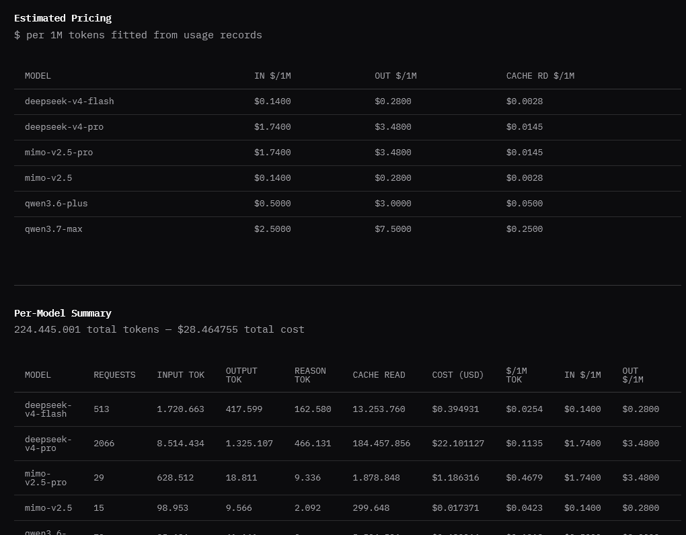
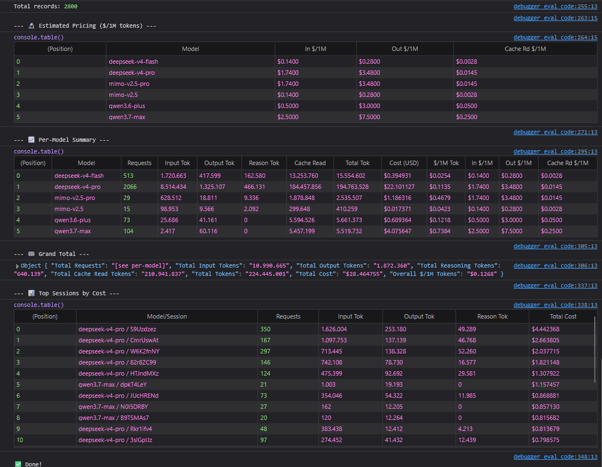

# OpenCode Go Stats

Adds token and cost breakdowns to [opencode.ai](https://opencode.ai) workspace usage pages.

There are three ways to run it:

| Version | Best for | Output |
|---|---|---|
| Browser extension | Keeping stats on the usage page | Inline tables and charts |
| Userscript | Getting the same dashboard through a userscript manager | Inline tables and charts |
| Console script | One-off inspection from DevTools | `console.table()` reports and session totals |

The extension and userscript share the same dashboard code. The console script is separate: it prints a report, exposes raw data on `window.__opencodeStats`, and includes the session breakdown.

## Tables



The dashboard adds two tables above the normal usage list.

| Table | What it shows |
|---|---|
| Estimated Pricing | Per-model input, output, and cache-read prices in dollars per 1M tokens. These are fitted from usage records that include cost data. |
| Per-Model Summary | Requests, input tokens, output tokens, reasoning tokens, cache reads, total cost, and effective dollars per 1M tokens for each model. |

The summary table also includes the fitted pricing columns when pricing can be estimated for the model.

## Charts

The dashboard has range filters for `All`, `Today`, `7d`, `30d`, `90d`, and `1y`. The selected range updates the tables and the chart together.

Two chart modes are daily stacked bars, split by model:

| Chart | What it answers |
|---|---|
| Spend Over Time | How much each model cost per day. |
| Requests | How many requests each model handled per day. |

Three chart modes compare models across the selected range:

Comparison charts show contextual controls for rank-by column, sort direction, and Token Mix percent/absolute display.

| Chart | What it answers |
|---|---|
| Cost / Request | Which models are most expensive per actual request. Rank by cost/request, total cost, requests, effective $/1M tokens, or average tokens/request. |
| Avg Tokens / Request | Which models use the largest requests, split into input, output, reasoning, and cache-read averages. Rank by total or any token component. |
| Token Mix | How each model's token usage is composed across input, output, reasoning, and cache reads. Switch between percent and absolute token volume, and rank by total tokens, token share, or cost. |

## Console Script



`dist/pull-stats.js` is for quick checks without installing anything. Open an opencode.ai workspace usage page, paste the script into the browser console, and run it.

It prints:

| Section | What it contains |
|---|---|
| Estimated Pricing | The same fitted per-model prices used by the dashboard. |
| Per-Model Summary | Request, token, cost, and effective price totals by model. |
| Grand Total | Workspace-wide token and cost totals. |
| Top Sessions by Cost | The 20 most expensive model/session pairs. This is console-only. |

After it finishes, the parsed records and computed summaries are available as `window.__opencodeStats`.

## Install

> **Prerequisite:** Build the extension/userscript first with `npm install && npm run build`.

### Browser Extension

Load the `dist/extension/` directory as an unpacked extension.

| Browser | Steps |
|---|---|
| Chrome | Open Extensions, enable Developer mode, choose Load unpacked, then select `dist/extension/`. |
| Firefox | Open `about:debugging`, choose This Firefox, choose Load Temporary Add-on, then select `dist/extension/manifest.json`. |

The extension runs on `https://opencode.ai/workspace/*/usage`.

### Userscript

Install `dist/opencode-stats.user.js` with [Tampermonkey](https://www.tampermonkey.net/), [Violentmonkey](https://violentmonkey.github.io/), or another userscript manager.
The userscript supports auto-update: your manager will automatically check for new versions and prompt you to update when a new release is published.

The userscript runs on the same usage pages as the extension and renders the same dashboard.

### Console Script

Open an opencode.ai workspace usage page, paste the contents of `dist/pull-stats.js` into DevTools, and run it.

## Build

```bash
npm install
npm run build
```

`npm run build` produces:

| Output | Source entry | Purpose |
|---|---|---|---|
| `dist/extension/content.js` | `src/entries/extension.ts` | Browser extension content script. |
| `dist/opencode-stats.user.js` | `src/entries/extension.ts` | Userscript dashboard. |
| `dist/opencode-stats.meta.js` | — | Userscript metadata for auto-update polling. |
| `dist/pull-stats.js` | `src/entries/console.ts` | Console-only report. |

All output goes to `dist/`.

## Release

```bash
npm run release
```

This builds the extension and writes `extension.zip`.

## Type Check

```bash
npm run check
```

### API Authentication

The `FN_ID` constant (see `src/packages/core/constants.ts`) is the server function identifier used by opencode.ai's
internal API gateway to route usage-history requests. It is a public routing key, not a secret,
and is embedded in the opencode.ai web client. If the upstream API changes, this value must be
updated in `src/packages/core/constants.ts`.

## How It Works

1. Reads the workspace ID from the current usage page URL.
2. Fetches usage pages through opencode.ai's internal `/_server` endpoint.
3. Deduplicates records and merges them with records cached in `localStorage`.
4. Computes per-model request, token, and cost totals.
5. Estimates per-model token prices by solving a linear system from records with cost data.
6. Renders the dashboard or prints the console report, depending on the script being used.

Pricing is estimated from your recorded usage, so a model may not show fitted prices until there is enough cost-bearing data for that model.
